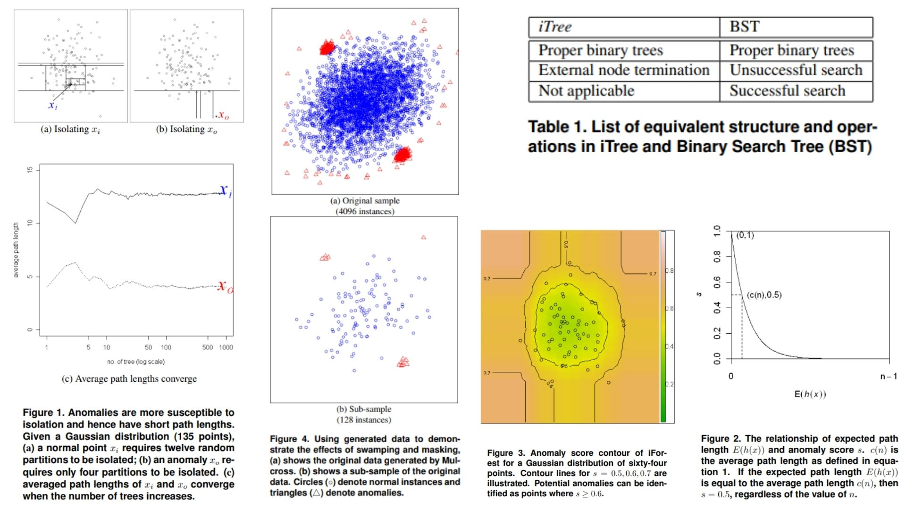

# 🌲 iForest-Replication — Isolation Forest for Anomaly Detection

This repository provides a **faithful Python replication** of the **iForest framework** for anomaly detection.  
The goal is to **reproduce the model, math, and tree logic** from the original paper without requiring full-scale training.

Highlights:

* **Anomaly detection via isolation** of points instead of profiling normal data 🍃  
* Uses **Isolation Trees (iTree)** to detect anomalies based on short path lengths 🪵  
* Efficient, linear time complexity with **low memory requirement** ⚡  
* Works well on **high-dimensional data** and large datasets 📊  

Paper reference: *[Isolation Forest for Anomaly Detection, Liu et al., 2008](https://cs.nju.edu.cn/zhouzh/zhouzh.files/publication/icdm08b.pdf)*  

---

## Overview 🖼️



> The pipeline uses an **ensemble of Isolation Trees**:  
> 1️⃣ Randomly partition features at each node  
> 2️⃣ Recursively split until instances are isolated  
> Anomalies are **isolated closer to tree roots** (short path length), while normal points are deeper.

Key points:

* **iTree**: binary tree built from recursive random splits  
* **iForest**: ensemble of multiple iTrees to average path lengths  
* **Path length $$h(x)$$**: number of edges from root to leaf for instance $$x$$  
* **Anomaly score $$s(x)$$**: normalized function of average path length $$E(h(x))$$  
  * $$s \approx 1$$ → likely anomaly  
  * $$s \ll 0.5$$ → likely normal  
* Sub-sampling size $$\psi$$ controls training sample size for efficiency  

---

## Core Math 🧮

**Average path length adjustment** (BST analogy):

$$
c(n) = 2H(n-1) - \frac{2(n-1)}{n}, \quad H(i) \approx \ln(i) + 0.5772156649
$$

**Anomaly score** for instance $$x$$:

$$
s(x, n) = 2^{- \frac{E(h(x))}{c(n)}}
$$

> Shorter $$E(h(x))$$ → higher $$s(x)$$ → more anomalous  

---

## Why iForest Matters 🌟

* Explicitly **isolates anomalies** rather than profiling normal points 🪄  
* **Handles high-dimensional & large datasets** efficiently 📈  
* **Few parameters**: number of trees $$t$$ and sub-sample size $$\psi$$ 🎯  

---

## Repository Structure 🏗️

```bash
iForest-Replication/
├── src/
│   ├── core/
│   │   ├── itree.py              # Single Isolation Tree (recursive splits)
│   │   ├── iforest.py            # Forest: ensemble of iTrees + aggregation
│   │   └── path_length.py        # h(x) calculation + recursion
│   │
│   ├── math/
│   │   └── score.py              # c(n) and anomaly score calculation
│   │
│   ├── utils/
│   │   ├── sampling.py           # Random sub-sampling (ψ)
│   │   └── split.py              # Random feature + split value
│   │
│   └── config.py                 # hyperparameters: t, ψ, tree height
│
├── images/
│   └── figmix.jpg                # Isolation Forest illustration
│
├── main.py                        # Demo / sanity check
├── requirements.txt
└── README.md
```

---

## 🔗 Feedback

For questions or feedback, contact:  
[barkin.adiguzel@gmail.com](mailto:barkin.adiguzel@gmail.com)
